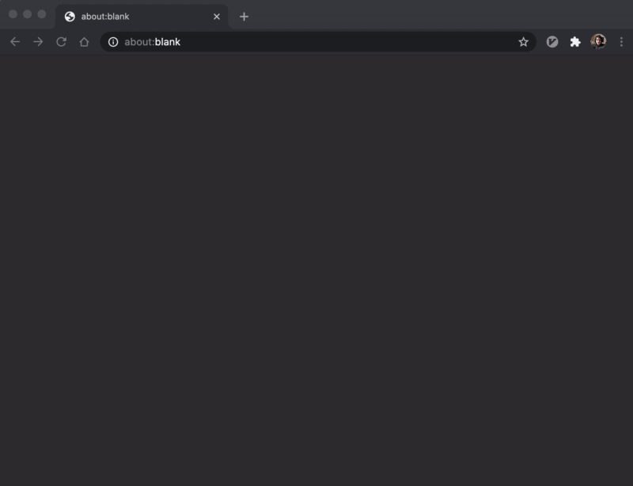

#  AWS Console Services – Alfred Workflow

A powerful workflow for quickly opening up AWS Console Services in your browser or searching for entities within them.

Supports Alfred 3, 4, and 5

## Installation
- [Download and extract the latest release](https://github.com/rkoval/alfred-aws-console-services-workflow/releases)
- Open the .alfredworkflow file in Finder
- Make sure your AWS Credentials and Region are set in your `~/.aws/credentials` and `~/.aws/config` files, respectively. This workflow will use your `default` profile by default within these files. See [the official AWS docs](https://docs.aws.amazon.com/sdk-for-go/v1/developer-guide/configuring-sdk.html#specifying-the-region) for more info on how to configure these

## Usage
To use, activate Alfred and type `aws` to trigger this workflow. From there:

- type any search term to search for services
- if the current service result has a 🗂 in the subtitle, press <kbd>Tab</kbd> to autocomplete into sub-services (for example, navigate to "Security Groups" within the "EC2" service)
- keep typing after autocompleting to filter sub-services
- if the current sub-service result has a 🔎 in the subtitle, press <kbd>Tab</kbd> again to start searching for its entities (for example, you can search for EC2 Instances when tabbed to `aws ec2 instances `)

At any time:
- press <kbd>Enter</kbd> to open the current result in your default browser
- press <kbd>⌘</kbd>+<kbd>Enter</kbd> to copy the result's URL to clipboard.

*Note that you must be logged in for the page to open directly to your service*. See [this config file](console-services.yml) for the full list of supported services and their sub-services and [this file](searchers/searchers_by_service_id.go) for the list of supported searchers.

## Advanced Features

- [Fuzzy filtering](https://godoc.org/github.com/deanishe/awgo/fuzzy) a la Sublime Text is supported
- Configurable [workflow environment variables](https://www.alfredapp.com/help/workflows/advanced/variables/#environment)
  - Search alias – If a sub-service has a ⭐ in the subtitle, you can use `,` as an alias for it to more quickly search for that entity. For example, in this workflow, the EC2 service's default entity is an EC2 instance, so `aws ec2 ,searchterm` is a shorter alias for `aws ec2 instances searchterm`. You can customize this alias by setting the `ALFRED_AWS_CONSOLE_SERVICES_WORKFLOW_SEARCH_ALIAS` environment variable to any other string.
  - Region override - By default, searchers will use the region configured in your `~/.aws/config` file. However, you can override this on a single query basis by typing `$`. This workflow will then populate a list of regions to select for this query. You can customize this alias by setting the `ALFRED_AWS_CONSOLE_SERVICES_OVERRIDE_AWS_REGION_ALIAS` environment variable to any other string.
  - Profile override - By default, searchers will use the default profile configured in your `~/.aws/credentials` file. However, you can override this on a single query basis by typing `@`. This workflow will then populate the list of profiles defined in your `~/.aws/credentials` file. You can customize this alias by setting the `ALFRED_AWS_CONSOLE_SERVICES_OVERRIDE_AWS_PROFILE_ALIAS` environment variable to any other string.
  - Cache expiration age – Sub-service entity searching makes heavy use of caching to make filtering performant and to prevent handling big requests/responses to/from AWS on every execution. The cache expiration age for each entity is set to 3 minutes by default. If you find that this is too short/long for your usage, you can set the `ALFRED_AWS_CONSOLE_SERVICES_WORKFLOW_MAX_CACHE_AGE_SECONDS` environment variable to the number of seconds that better suits your need.
  - Custom AWS Management Console domain – If your AWS account's management console lives at a domain that is not the standard "console.amazonaws.com", you can set a custom domain with the `ALFRED_AWS_CONSOLE_SERVICES_WORKFLOW_AWS_CONSOLE_DOMAIN` environment variable. This workflow will then populate all relevant URLs with that domain when opening links.
  - AWS settings – You can override any/all AWS configuration values which the underlying AWS library should respect.

## Contributing

See [this README](CONTRIBUTING.md)

## Packaging for Release

See [this README](release_tools/README.md)

## Donating

Like this workflow? Consider donating! 😻

- [Patreon](https://www.patreon.com/rkoval_alfred_aws_console_services_workflow)
- 
- [ryankoval.pizza](https://ryankoval.pizza)
